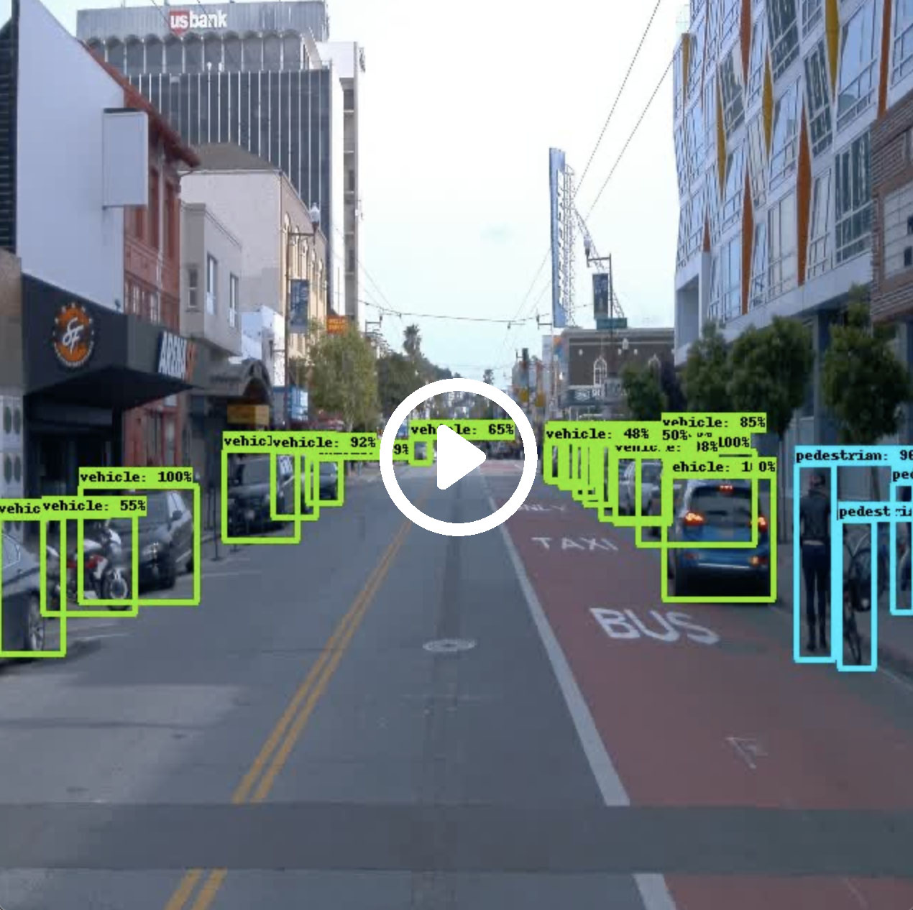

# self-driving-car-object-detection
Object Detection in an Urban Environment Project for Udacity's Self-Driving Car nano degree

The goal of this project is to train a CNN-based network (Faster R-CNN) for object detection and predict over pre-recorded footage.
The detection categories are limited to: Vehicle, Bicycle and Pedestrian.

Trained network detection results video:

